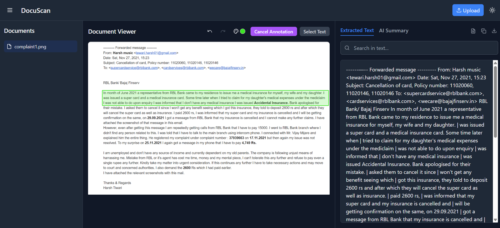

# DocuScan

DocuScan is a document scanning application with an integrated AI summary feature powered by Google Gemini. It allows users to upload documents, extract text using OCR, and generate concise summaries of the content.

## Screenshot

**Note:** Please make sure to add your screenshot image file (e.g., `screenshot.png`) to the `assets/` directory in your project's root. You will need to manually add the image file to your repository.

## Features

- Document Upload
- Optical Character Recognition (OCR)
- AI-powered Document Summarization (using Google Gemini)
- View Extracted Text

## Getting Started

_(You may want to add instructions here on how to set up and run the project)_

## Contributing

_(You may want to add instructions here on how others can contribute)_

## License

_(You may want to add license information here)_
